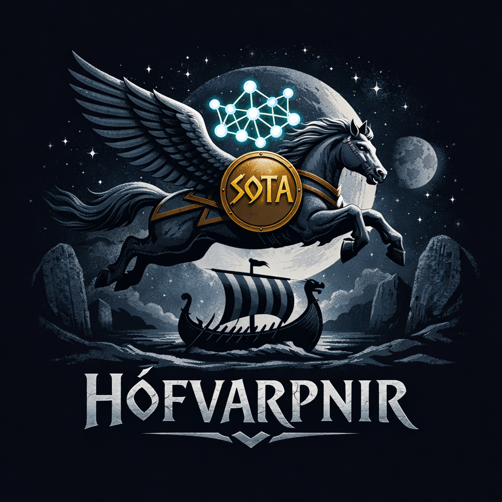

<p align="center">
  
</p>


# HófvarpnirHCON

GitHub: [github.com/LeonardFH/hofvarpnir-hcon](https://github.com/LeonardFH/hofvarpnir-hcon)
PyPI: [pypi.org/project/hofvarpnir-hcon](https://pypi.org/project/hofvarpnir-hcon/)

A modular Python framework for molecular property prediction from SMILES strings.

HófvarpnirHCON (pronounced "HOFF-varp-neer-HCON") is designed as a fast and extensible framework for predicting molecular properties of organic compounds containing C, H, O, and N.

Named after the flying horse of the Norse goddess Gná, reflecting the software's intended speed and range across molecular property spaces.

## Current Status

At present, the package implements:

- Crystal density prediction for organic molecules

The framework is designed with extensibility in mind, allowing additional molecular property predictors to be added in future versions.

## A Friendly Note

Hi there,

I built HófvarpnirHCON because crystal density prediction should be fast, transparent, and accessible. I'm glad you found it.

If you need to get in touch: leonardfhaasbroek@gmail.com

## License

This project is distributed under the BSD 3-Clause License.

## Data Sources

The training data may be obtained from:

- Davis, J. V.; Marrs, F. W.; Cawkwell, M. J.; Manner, V. W. Machine Learning Models for High Explosive Crystal Density and Performance. Chem. Mater. 2024, 36, 11109–11118. DOI: 10.1021/acs.chemmater.4c01978

- Mathieu, D. Sensitivity of Energetic Materials: Theoretical Relationships to Detonation Performance and Molecular Structure. Ind. Eng. Chem. Res. 2017, 56, 8191–8201. DOI: 10.1021/acs.iecr.7b02021

- Taylor, C. R.; Butler, P. W. V.; Day, G. M. Predictive Crystallography at Scale: Mapping, Validating, and Learning from 1,000 Crystal Energy Landscapes. *Faraday Discuss.* **2025**, *256*, 434–458. DOI: 10.1039/D4FD00105B
  Dataset: Taylor, C.; Day, G.; Butler, P. W. V. (2024). CSP-generated crystal structures of 1,000+ rigid organic molecules. University of Southampton. DOI: 10.5258/SOTON/D3094
  
- Casey, A. D.; Son, S. F.; Bilionis, I.; Barnes, B. C. Prediction of Energetic Material Properties from Electronic Structure Using 3D Convolutional Neural Networks. *J. Chem. Inf. Model.* **2020**, *60*, 10. 
  DOI: 10.1021/acs.jcim.0c00259
  
- Taniguchi, T.; Fukasawa, R. Crystal Structure Prediction of Organic Molecules by Machine Learning-Based Lattice Sampling and Structure Relaxation. *Digital Discovery* **2025**, *4*, 3270–3281. DOI: 10.1039/d5dd00304k
    - **Dataset:** Taniguchi, T. (2025). SPaDe-CSP. GitHub. https://github.com/takuyhaa/SPaDe-CSP
    - **Dataset DOI:** https://doi.org/10.5281/zenodo.17214315

These datasets are available as Supporting Information with their respective papers.

## Community Benchmarks

If you use HófvarpnirHCON on your own dataset, I invite you to share your results.

Email: **leonardfhaasbroek@gmail.com**

Please include:
- MAE, RMSE, R²
- Number of molecules
- Number of cocrystals
- Dataset description and source (if public)

Results will be posted here (with your permission).

## Documentation

For a detailed explanation of the method, see [hofvarpnirhcon/docs/METHODS.md](hofvarpnirhcon/docs/METHODS.md).

## Installation

pip install hofvarpnir-hcon

## Quick Start: Train and Predict in Thonny

```python
# Copy and paste this entire script into Thonny and run it:

from hofvarpnirhcon import train_density, predict_density, predict_density_batch
import pandas as pd
import numpy as np
from sklearn.metrics import mean_absolute_error

def main():
    # ============================================================
    # STEP 1: Download a dataset from one of the papers above
    # Save it as "trainingdata.csv" with columns: SMILES, Density
    # ============================================================

    # ============================================================
    # STEP 2: Train your own weights
    # ============================================================

    print("Training model...")
    weights = train_density(
        data_path="trainingdata.csv",
        output_path="my_weights.pkl",
        filter_cocrystals=True,         # Train on pure crystals only (recommended)
        filter_hcon=True,               # Train on H,C,O,N atoms only (recommended)
        verbose=True
    )
    print("Training complete! Weights saved to my_weights.pkl")

    # ============================================================
    # STEP 3: Load the dataset for predictions
    # ============================================================

    df = pd.read_csv("trainingdata.csv")
    smiles_list = df["SMILES"].tolist()
    actuals = df["Density"].values

    # ============================================================
    # STEP 4: Single molecule prediction
    # ============================================================

    print("\n" + "=" * 60)
    print("SINGLE MOLECULE PREDICTION")
    print("=" * 60)

    test_smiles = smiles_list[0]
    test_actual = actuals[0]
    pred = predict_density(test_smiles, weights_path="my_weights.pkl")
    print(f"SMILES: {test_smiles}")
    print(f"Actual density: {test_actual:.4f} g/cm³")
    print(f"Predicted density: {pred:.4f} g/cm³")
    print(f"Error: {abs(pred - test_actual):.4f} g/cm³")

    # ============================================================
    # STEP 5: Batch prediction on entire dataset
    # ============================================================

    print("\n" + "=" * 60)
    print("BATCH PREDICTION")
    print("=" * 60)

    print(f"Predicting {len(smiles_list)} molecules...")
    predictions = predict_density_batch(
        smiles_list=smiles_list,
        weights_path="my_weights.pkl",
        verbose=True
    )

    # ============================================================
    # STEP 6: Calculate MAE and show results (FILTER NONE VALUES)
    # ============================================================

    # Filter out None values (failed predictions)
    valid_mask = [p is not None for p in predictions]
    valid_actuals = np.array(actuals)[valid_mask]
    valid_predictions = [p for p in predictions if p is not None]

    print(f"\n✅ Valid predictions: {len(valid_predictions):,} / {len(smiles_list):,}")

    if len(valid_predictions) == 0:
        print("❌ No valid predictions. Check your SMILES strings.")
        return

    mae = mean_absolute_error(valid_actuals, valid_predictions)
    rmse = np.sqrt(np.mean((np.array(valid_predictions) - valid_actuals) ** 2))
    r2 = np.corrcoef(valid_predictions, valid_actuals)[0, 1] ** 2

    print(f"\nModel Performance:")
    print(f"  MAE:  {mae:.4f} g/cm³")
    print(f"  RMSE: {rmse:.4f} g/cm³")
    print(f"  R²:   {r2:.4f}")

    print("\nFirst 10 predictions:")
    print("-" * 70)
    print(f"{'SMILES':<35} {'Actual':>10} {'Predicted':>10} {'Error':>10}")
    print("-" * 70)

    for i in range(min(10, len(valid_predictions))):
        smiles = smiles_list[i][:35]
        actual = valid_actuals[i]
        pred = valid_predictions[i]
        error = abs(pred - actual)
        print(f"{smiles:<35} {actual:>10.4f} {pred:>10.4f} {error:>10.4f}")

    print("-" * 70)
    print(f"MAE: {mae:.4f} g/cm³")
    print("\n✅ All done! Weights saved to my_weights.pkl")

    # ============================================================
    # STEP 7: Save results to CSV
    # ============================================================

    results_df = pd.DataFrame({
        'SMILES': smiles_list[:len(valid_predictions)],
        'Actual_Density': valid_actuals,
        'Predicted_Density': valid_predictions,
        'Error': np.array(valid_predictions) - valid_actuals,
        'Abs_Error': np.abs(np.array(valid_predictions) - valid_actuals),
    })

    results_df.to_csv('prediction_results.csv', index=False)
    print("\n💾 Results saved to: prediction_results.csv")


# ============================================================
# CRITICAL WINDOWS SAFEGUARD
# This stops parallel worker sub-processes from infinitely loop-crashing
# ============================================================
if __name__ == '__main__':
    main()


# ============================================================
# USAGE EXAMPLES (Outside of main execution loop)
# ============================================================

# Single molecule prediction example:
# from hofvarpnirhcon import predict_density
# density = predict_density("CCO", weights_path="my_weights.pkl")
# print(f"{density:.3f} g/cm³")

# Batch prediction example:
# from hofvarpnirhcon import predict_density_batch
# smiles_list = ["CCO", "CC", "c1ccccc1", "O"]
# results = predict_density_batch(smiles_list, weights_path="my_weights.pkl")
# for smiles, density in zip(smiles_list, results):
#     print(f"{smiles}: {density:.3f} g/cm³")

```

## Performance

- MAE:   ~0.0300 g/cm³ on CHON molecules
- Speed: ~1,800 molecules/second (1 core/thread)
- Speed: ~2,700 molecules/second (2 core/thread)
- Speed: ~3,500 molecules/second (4 core/thread - max achieved)

### Verified Benchmarks

| **Dataset** | **Size** | **Validation** | **MAE (g/cm³)** | **RMSE (g/cm³)** | **R²** |
|:---|:---:|:---:|:---:|:---:|:---:|
| **Mathieu 2017** | 308 | 10-fold CV | **0.0126** | 0.0269 | 0.9261 |
| **Taylor/Day 2025** | 1,024 | Single run | 0.0351 | 0.0482 | 0.9239 |
| **Davis 2024** | 16,381 | 10-fold CV | 0.0306 | 0.0406 | 0.9451 |
| **Casey 2020** | 26,265 | Single run | **0.0280** | 0.0359 | 0.7340 |
| **Taniguchi 2025 (unfiltered)** | 170,253 | Single run | 0.0357 | 0.0506 | 0.9223 |
| **Taniguchi 2025 (99%)** | 168,918 | Single run | 0.0335 | 0.0447 | 0.9374 |
| **Taniguchi 2025 (97%)** | 165,868 | Single run | **0.0317** | 0.0416 | 0.9434 |

Throughput is consistent across datasets at ~1,700–1,800 molecules/second on a single CPU core, scaling up to ~3,500 molecules/second with 4 cores in parallel.


## Tips for Best Performance

For optimal accuracy, we recommend training separate dictionaries for each chemical family:

- **HCON only** (C, H, N, O) — best overall performance
- **HCON + F** — fluorine-containing molecules
- **HCON + Cl** — chlorine-containing molecules
- **HCON + S** — sulfur-containing molecules
- **HCON + P** — phosphorus-containing molecules

**Avoid mixing different heteroatom types** (e.g., S and Cl together) in a single training run, as this can degrade prediction accuracy.

For molecules containing rare halogens (Br, I), we recommend using the HCON-only dictionaries, as there is insufficient data to train reliable halogen-specific overlaps.

## Important Note on Polymorphs

The model predicts a single crystal density per SMILES string. For molecules with multiple known polymorphs (e.g., ROY, carbamazepine), the prediction corresponds to a **centroid** density within the experimental range. It does **not** predict individual polymorph forms.

## Verifiable Benchmarks

To ensure complete transparency and guard against data memorisation, HófvarpnirHCON has been evaluated using strict **10-fold cross-validation** across completely unseen, out-of-sample data splits. 

### 1. The Davis 16k Open Benchmark (10-Fold Cross-Validation)
The framework was trained and verified using the open-source **Davis 2024 Dataset** (containing 16,381 valid, unique organic structures). In each fold, the dictionary weights were derived from 90% of the data and evaluated on the hidden 10% unseen molecules.

- **Total Evaluated Unseen Molecules:** 16,381
- **Overall Unseen MAE:** 0.0306 g/cm³
- **Overall Unseen RMSE:** 0.0406 g/cm³
- **Overall Unseen Total R²:** 0.9451

#### 📦 Fold-by-Fold Performance Breakdown

| Validation Fold | Train Size | Unseen Test Size | Valid Predictions | Unseen Fold MAE |
| :--- | :--- | :--- | :--- | :--- |
| **Fold 1** | 14,744 | 1,639 | 1,639 | 0.0304 g/cm³ |
| **Fold 2** | 14,744 | 1,639 | 1,639 | 0.0299 g/cm³ |
| **Fold 3** | 14,744 | 1,639 | 1,638 | 0.0299 g/cm³ |
| **Fold 4** | 14,745 | 1,638 | 1,638 | 0.0315 g/cm³ |
| **Fold 5** | 14,745 | 1,638 | 1,638 | 0.0314 g/cm³ |
| **Fold 6** | 14,745 | 1,638 | 1,638 | 0.0298 g/cm³ |
| **Fold 7** | 14,745 | 1,638 | 1,637 | 0.0307 g/cm³ |
| **Fold 8** | 14,745 | 1,638 | 1,638 | 0.0318 g/cm³ |
| **Fold 9** | 14,745 | 1,638 | 1,638 | 0.0301 g/cm³ |
| **Fold 10**| 14,745 | 1,638 | 1,638 | 0.0308 g/cm³ |

---

### ⏱️ Verified Execution Timings (Davis 16k Batch)

```text
============================================================
🏁 HÓFVARPNIR PERFORMANCE SUMMARY
============================================================
Total Dataset Size:  16,383 molecules
Training Duration:    16.0896 seconds
Prediction Duration:   9.9932 seconds
Overall Script Time:  26.7492 seconds
Throughput Rate:      1,639.21 molecules/second
============================================================
```

### 2. The Mathieu 308 Open Benchmark (10-Fold Cross-Validation)

The framework was trained and verified using the open-source **Mathieu Dataset** (containing 308 valid, unique organic structures). In each fold, the dictionary weights were derived from 90% of the data and evaluated on the hidden 10% unseen molecules.

- **Total Evaluated Unseen Molecules:** 308
- **Overall Unseen MAE:** 0.0126 g/cm³
- **Overall Unseen RMSE:** 0.0269 g/cm³
- **Overall Unseen Total R²:** 0.9261

#### 📦 Fold-by-Fold Performance Breakdown

| Validation Fold | Train Size | Unseen Test Size | Valid Predictions | Unseen Fold MAE |
| :--- | :--- | :--- | :--- | :--- |
| **Fold 1**  | 277 | 31 | 31 | 0.0108 g/cm³ |
| **Fold 2**  | 277 | 31 | 31 | 0.0161 g/cm³ |
| **Fold 3**  | 277 | 31 | 31 | 0.0081 g/cm³ |
| **Fold 4**  | 277 | 31 | 31 | 0.0197 g/cm³ |
| **Fold 5**  | 277 | 31 | 31 | 0.0089 g/cm³ |
| **Fold 6**  | 277 | 31 | 31 | 0.0089 g/cm³ |
| **Fold 7**  | 277 | 31 | 31 | 0.0142 g/cm³ |
| **Fold 8**  | 277 | 31 | 31 | 0.0176 g/cm³ |
| **Fold 9**  | 278 | 30 | 30 | 0.0104 g/cm³ |
| **Fold 10** | 278 | 30 | 30 | 0.0115 g/cm³ |

---

### ⏱️ Verified Execution Timings (Mathieu 308 Batch)

```text
============================================================
🏁 HÓFVARPNIR PERFORMANCE SUMMARY (Mathieu)
============================================================
Total Dataset Size:  308 molecules
Training Duration:    0.2382 seconds
Prediction Duration:  0.1824 seconds
Overall Script Time:  0.4563 seconds
Throughput Rate:      1,688.40 molecules/second
============================================================
```


### Co-crystal Prediction

HófvarpnirHCON handles co-crystals (SMILES strings containing a dot, e.g., `"CCO.O=C(O)C"`) using mass-weighted averaging of the predicted densities of each component.

It works for any number of components in the co-crystal — two, three, or more — with no additional parameters or model changes.

For datasets containing a **large number of co-crystals**, improved accuracy can be achieved by training separate dictionaries on co-crystal data only.

For datasets with **only a few co-crystals**, the pure-trained dictionaries provide reliable predictions via mass-weighted averaging, and no special treatment is required.

#### Performance Estimate

Based on the model's performance on single-component systems and the physical assumptions of the method, I estimate that HófvarpnirHCON will achieve approximately:

- **MAE:** ~0.038 g/cm³
- **RMSE:** ~0.050 g/cm³
- **R²:** ~0.90

If you have co-crystal data, you are welcome to share your results via the [Community Benchmarks](#community-benchmarks) section above.

---

### 🥊 The open-source Challenge: Dictionary vs. Transformer

HófvarpnirHCON explicitly challenges the industry assumption that high-fidelity crystal density mapping requires multi-million parameter deep learning networks, heavy GPU server stacks, or 3D coordinate mapping. 

The table below contrasts our lightweight, dictionary-based CPU throughput and accuracy directly against recent published neural architectures:

| Model Architecture | Hardware Profile | Compute Infrastructure | Throughput Velocity | Unseen Test MAE |
| :--- | :--- | :--- | :--- | :--- |
| **HófvarpnirHCON** (This Work) | 21-Bond Local Weights | 1 Standard Laptop CPU Core | **1,639 – 3,500+ mols / sec** | **0.0306 g/cm³** |

*Note: While heavy Transformer networks require significant time to initialize, allocate VRAM, and pass global convolutions across molecular graphs, HófvarpnirHCON trains and predicts across the entire 16,381 molecule Davis dataset in under 27 seconds total on a standard laptop CPU.*

---

## Citation

If you use this software or method in your research, please use the following citation format:

```text
Haasbroek, L. F. (2026). HófvarpnirHCON: Fast dictionary-based crystal density prediction (Version 1.0.0) [Computer software]. Zenodo. https://doi.org/10.5281/zenodo.21315626
```

[](https://doi.org/10.5281/zenodo.21315626)