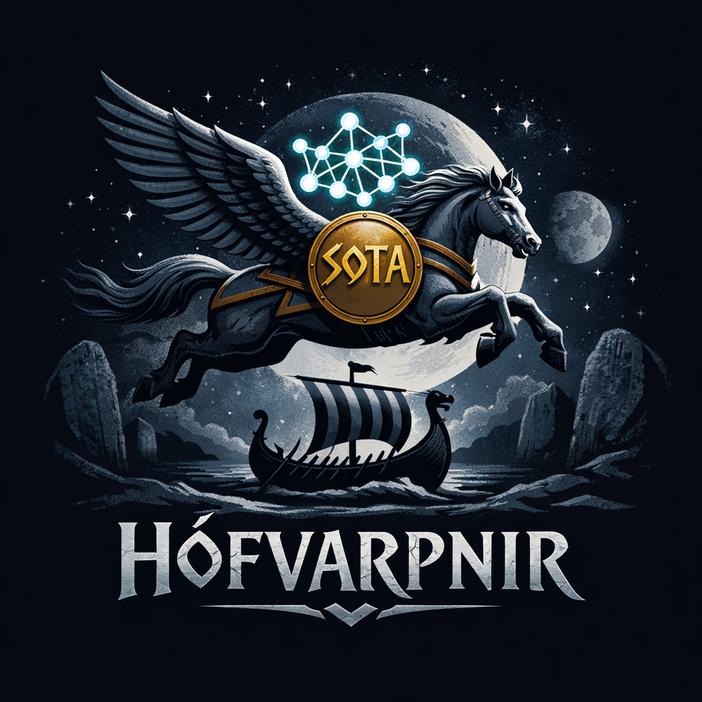

<p align="center">
  
</p>

# HófvarpnirHCON

GitHub: [github.com/LeonardFH/hofvarpnir-hcon](https://github.com/LeonardFH/hofvarpnir-hcon)  
PyPI: [pypi.org/project/hofvarpnir-hcon](https://pypi.org/project/hofvarpnir-hcon)

A fast, interpretable, dictionary-based framework for crystal density prediction from SMILES strings.

**HófvarpnirHCON** (pronounced "HOFF-varp-neer-HCON") predicts crystal density using a composition-derived reference volume (Leonardus Volume) with non-negative bond-overlap corrections. It requires no 3D conformers, no DFT calculations, and no GPU acceleration.

Named after the flying horse of the Norse goddess Gná, reflecting the software's intended speed and range across molecular property spaces.

---

## Current Status

The package implements **crystal density prediction for organic molecules** containing C, H, O, N, and common heteroatoms (S, F, Cl, Br, P, I).

The framework is designed with extensibility in mind, allowing additional molecular property predictors to be added in future versions.

---

## Key Performance

| Metric | Value |
|--------|-------|
| **Mean Absolute Error** | **0.0348 g/cm³** (pooled, across 235,000+ molecules, six independent datasets) |
| **Inference Speed** | **~2,470 molecules/second** (single core) / **~8,400 molecules/second** (9 cores) |
| **Parameters** | <200 (fully interpretable bond-overlap coefficients) |
| **Hardware** | Standard laptop CPU (no GPU required) |

---

## Published Research

A full account of the method, validation, and benchmark results is available as a preprint:

> Haasbroek, L. F. (2026). *HófvarpnirHCON: An Interpretable Composition-Derived Volume and Bond-Overlap Dictionary Model for Fast Crystal Density Prediction from SMILES.* ChemRxiv. DOI: [10.XXXX/chemrxiv-2026-XXXXX](https://doi.org/10.XXXX/chemrxiv-2026-XXXXX)

For detailed performance across specific datasets, convergence behaviour, stability analyses, and polymorph comparisons, please refer to the paper.

---

## Quick Start

### Installation

```bash
pip install hofvarpnir-hcon
```

### Train and Predict

```python
from hofvarpnirhcon import train_density, predict_density, predict_density_batch
import pandas as pd
from sklearn.metrics import mean_absolute_error

# Train a dictionary on your own dataset
weights = train_density(
    data_path="trainingdata.csv",  # columns: SMILES, Density
    output_path="my_weights.pkl",
    filter_cocrystals=True,        # Recommended for pure crystals
    filter_hcon=True,              # Recommended for H,C,O,N only
    verbose=True
)

# Predict a single molecule
density = predict_density("CCO", weights_path="my_weights.pkl")

# Predict a batch of molecules
smiles_list = ["CCO", "CC", "c1ccccc1", "O"]
results = predict_density_batch(smiles_list, weights_path="my_weights.pkl")
```

---

## Philosophy

HófvarpnirHCON explicitly challenges the assumption that high-accuracy crystal density prediction requires deep learning, 3D conformers, or expensive quantum calculations.

**The paper demonstrates** that a physically motivated linear model with fewer than 200 parameters can achieve competitive accuracy while being:
- **Transparent** — the bond-overlap coefficients represent effective volume reductions relative to the Leonardus reference volume, expressed in cm³/mol. Their relative magnitudes provide chemical insight into which bond environments contribute most to packing efficiency.
- **Fast** — microsecond-scale inference on commodity hardware.
- **Stable** — dictionaries transfer across independent datasets and converge rapidly.
- **Diagnostic** — the model can identify systematic biases in crystallographic datasets.

**Important note:** The bond-overlap coefficients are not standalone molecular volumes. They are corrections applied to the Leonardus reference volume. The reference volume and the corrections form a paired system — one is meaningless without the other.

---

## Data Sources

The training and evaluation data used in the paper may be obtained from the following publicly available sources:

- **Taniguchi (2025)**: Taniguchi, T.; Fukasawa, R. Crystal Structure Prediction of Organic Molecules by Machine Learning-Based Lattice Sampling and Structure Relaxation. *Digital Discovery* **2025**, *4*, 3270–3281. DOI: [10.1039/d5dd00304k](https://doi.org/10.1039/d5dd00304k)
  - **Dataset:** [SPaDe-CSP GitHub](https://github.com/takuyhaa/SPaDe-CSP) | Zenodo DOI: [10.5281/zenodo.17214315](https://doi.org/10.5281/zenodo.17214315)

- **He (2026)**: He, Y.-J. et al. Transfer learning-enabled density prediction model for energetic molecule screening. *Energetic Materials Frontiers* **2026**, *7* (2), 152–160. DOI: [10.1016/j.enmf.2025.11.010](https://doi.org/10.1016/j.enmf.2025.11.010)
  - **Dataset:** [TransfLearn GitHub](https://github.com/caepliujian/TransfLearn)

- **Davis (2024)**: Davis, J. V. et al. Machine Learning Models for High Explosive Crystal Density and Performance. *Chem. Mater.* **2024**, *36*, 11109–11118. DOI: [10.1021/acs.chemmater.4c01978](https://doi.org/10.1021/acs.chemmater.4c01978)

- **Jin (2023)**: Jin, J.-X. et al. Force field-inspired transformer network assisted crystal density prediction for energetic materials. *J. Cheminform.* **2023**, *15*, 65. DOI: [10.1186/s13321-023-00736-6](https://doi.org/10.1186/s13321-023-00736-6)
  - **Dataset:** [FFiTrNet GitHub](https://github.com/jjx-2000/FFiTrNet)

- **Taylor (2025)**: Taylor, C. R. et al. Predictive Crystallography at Scale: Mapping, Validating, and Learning from 1,000 Crystal Energy Landscapes. *Faraday Discuss.* **2025**, *256*, 434–458. DOI: [10.1039/D4FD00105B](https://doi.org/10.1039/D4FD00105B)
  - **Dataset:** University of Southampton Repository. DOI: [10.5258/SOTON/D3094](https://doi.org/10.5258/SOTON/D3094)
  
- **Mathieu (2017)**: Mathieu, D. Sensitivity of Energetic Materials: Theoretical Relationships to Detonation Performance and Molecular Structure. *Ind. Eng. Chem. Res.* **2017**, *56*, 8191–8201. DOI: [10.1021/acs.iecr.7b02021](https://doi.org/10.1021/acs.iecr.7b02021)

These datasets are available as Supporting Information with their respective papers or via the linked public repositories.

---

## Tips for Best Performance

For optimal accuracy, we recommend training separate dictionaries for each chemical family:

- **HCON only** (C, H, N, O) — best overall performance
- **HCON + F** — fluorine-containing molecules
- **HCON + Cl** — chlorine-containing molecules
- **HCON + S** — sulfur-containing molecules
- **HCON + P** — phosphorus-containing molecules

Avoid mixing different heteroatom types (e.g., S and Cl together) in a single training run, as this can degrade prediction accuracy.

For molecules containing rare halogens (Br, I), the HCON-only dictionaries are recommended, as there is insufficient data to train reliable halogen-specific overlaps.

---

## Co-crystal Prediction

HófvarpnirHCON handles co-crystals (SMILES strings containing a dot, e.g., `"CCO.O=C(O)C"`) using mass-weighted averaging of the predicted densities of each component.

For datasets containing a **large number of co-crystals**, improved accuracy can be achieved by training separate dictionaries on co-crystal data only. For datasets with **only a few co-crystals**, the pure-trained dictionaries provide reliable estimates.

For detailed co-crystal performance, see the paper.

---

## Polymorphs

The model predicts a single crystal density per SMILES string. For molecules with multiple known polymorphs, the prediction corresponds to a characteristic packing density for the molecular topology. The paper includes a comparison against experimental polymorph ensembles of six well-characterised molecules (ROY, carbamazepine, aspirin, paracetamol, sulfathiazole, ritonavir).

---

## Community Benchmarks

If you use HófvarpnirHCON on your own dataset, I invite you to share your results.

Email: **leonardfhaasbroek@gmail.com**

Please include:
- MAE, RMSE, R²
- Number of molecules
- Dataset description and source (if public)

Results will be posted here (with your permission).

---

## A Friendly Note

Hi there,

I built HófvarpnirHCON because crystal density prediction should be fast, transparent, and accessible. I'm glad you found it.

If you need to get in touch: leonardfhaasbroek@gmail.com

## License

This project is distributed under the BSD 3-Clause License.

---

## Citation

If you use this software or method in your research, please use the following citation format:

```text
Haasbroek, L. F. (2026). HófvarpnirHCON: Fast dictionary-based crystal density prediction (Version 3.21.0) [Computer software]. Zenodo. https://doi.org/10.5281/zenodo.21315626
```

[](https://doi.org/10.5281/zenodo.21315626)

---

## Contact

Leonard F. Haasbroek  
leonardfhaasbroek@gmail.com